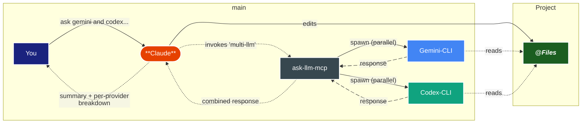

# How It Works

Ask LLM is a set of MCP servers that bridge your AI client (Claude Code, Claude Desktop, Cursor, etc.) with up to three LLM providers running locally on your machine: Google's Gemini CLI, OpenAI's Codex CLI, and Ollama (local models). Your client decides when to delegate work to one or more providers based on what you ask.

## Natural Language Workflow

Your client (typically Claude) decides when to call the MCP tools based on context:

- `🔍 comparative analysis` — different AI perspectives for validation (`multi-llm`, `/compare`)
- `📋 code review & big changes` — second opinions on implementation (`/gemini-review`, `/codex-review`, `/multi-review`)
- `📚 large-context analysis` — Gemini's 1M+ token window for whole-codebase reads
- `💡 creative problem solving` — `/brainstorm` for multi-LLM ideation with Claude Opus as a peer
- `🔒 private analysis` — Ollama for code that can't leave the machine

This intelligent selection happens automatically — you just ask in natural language.

## Request Flow

⇣ A typical multi-provider call ↴

<DiagramModal>

</DiagramModal>

For a single-provider call (`ask-llm` with `provider: "gemini"`), only one of the provider lanes fires. For `multi-llm`, both fire in parallel via `Promise.all` inside the MCP server process — per-provider failures are isolated, so one provider hitting quota doesn't fail the whole call ([ADR-066](https://github.com/Lykhoyda/ask-llm/blob/main/docs/DECISIONS.md)).

## What's Inside the MCP Server

Each provider's executor wraps the underlying CLI with operational hardening that took multiple ADRs to get right:

- **Quota fallback** — Gemini Pro → Flash on `RESOURCE_EXHAUSTED` ([ADR-044](https://github.com/Lykhoyda/ask-llm/blob/main/docs/DECISIONS.md)); Codex `gpt-5.5` → `gpt-5.5-mini` on quota errors ([ADR-028](https://github.com/Lykhoyda/ask-llm/blob/main/docs/DECISIONS.md), model bumped in [ADR-067](https://github.com/Lykhoyda/ask-llm/blob/main/docs/DECISIONS.md))
- **Stdin handling** — Codex needs an EOF-terminated pipe rather than `/dev/null`, otherwise it errors out ([ADR-042](https://github.com/Lykhoyda/ask-llm/blob/main/docs/DECISIONS.md))
- **PATH resolution** — macOS GUI clients (Claude Desktop) don't inherit your shell's PATH; the server resolves it from your login shell at startup ([ADR-047](https://github.com/Lykhoyda/ask-llm/blob/main/docs/DECISIONS.md))
- **Live progressive output** — Gemini's `--output-format stream-json` deltas are parsed and forwarded to MCP progress notifications, so users see Gemini's prose unfolding rather than a frozen wait ([ADR-057](https://github.com/Lykhoyda/ask-llm/blob/main/docs/DECISIONS.md))
- **Session continuity** — all three providers support multi-turn via the `sessionId` parameter; Gemini and Codex use native CLI resume, Ollama uses server-side conversation replay ([ADR-058](https://github.com/Lykhoyda/ask-llm/blob/main/docs/DECISIONS.md), [ADR-063](https://github.com/Lykhoyda/ask-llm/blob/main/docs/DECISIONS.md))
- **Structured responses** — every `ask-*` tool returns both human-readable text AND a structured `AskResponse` (provider, response, model, sessionId, usage) via MCP `outputSchema` so programmatic clients don't have to parse the response footer ([ADR-065](https://github.com/Lykhoyda/ask-llm/blob/main/docs/DECISIONS.md))

You don't need to think about any of this — it's just the infrastructure that makes the natural-language flow work reliably.

## When to Use Which Tool

| Situation | Tool |
|---|---|
| Single-provider question, want it to work | `ask-llm` (orchestrator routes by `provider` param) |
| Compare what multiple providers say | `multi-llm` (or `/compare` skill in Claude Code) |
| Code review with verified findings | `/multi-review` skill (verifies each finding against source) |
| Brainstorm with multi-LLM consensus | `/brainstorm` skill (Claude Opus as peer participant) |
| Large-context analysis (whole codebase) | `ask-gemini` directly (1M+ token context) |
| Structured code edits to apply | `ask-gemini-edit` (returns OLD/NEW blocks) |
| Air-gapped / private | `ask-llm` with `provider: "ollama"` |
| Diagnose setup problems | `npx ask-llm-mcp doctor` (CLI) or `diagnose` (MCP tool) |

See [How to Ask](/usage/how-to-ask) for full parameter reference and [Strategies & Examples](/usage/strategies-and-examples) for proven workflow patterns.
